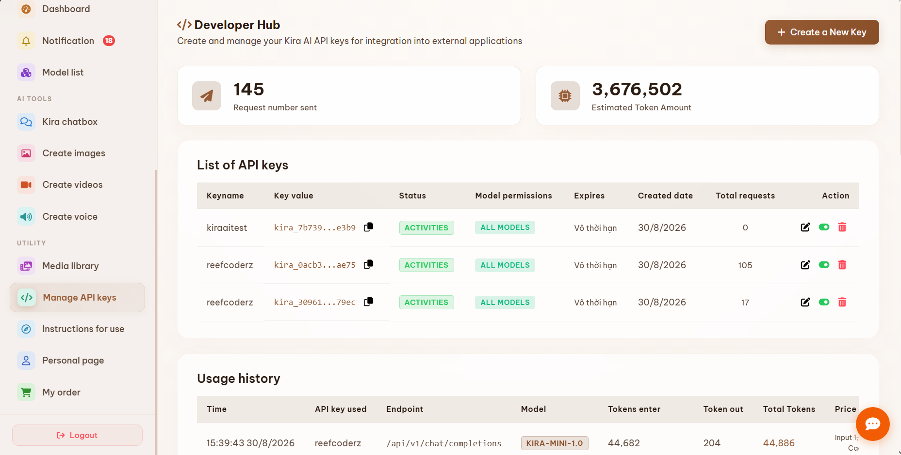
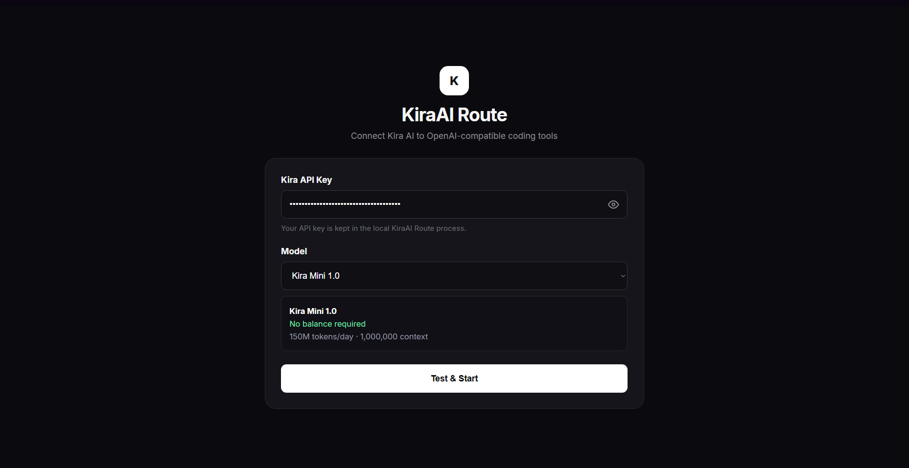

<div align="center">

# 🚀 KiraAI Route

**High-performance, zero-latency OpenAI-compatible local AI gateway routing Kira AI models for Codex, Claude Code, and developer tools.**

[](https://www.npmjs.com/package/@vibhav1207/kiraairoute)
[](LICENSE)
[](https://nodejs.org)
[](https://www.typescriptlang.org)
[](https://github.com/Vibhav1207/kiraairoute)

[API Key Guide](#-how-to-obtain-a-kira-api-key) • [Node.js Setup](#-prerequisites-nodejs--npm) • [Installation](#-installation--usage-guide) • [Codex Setup](#-connecting-codex--ai-tools) • [Supported Models](#-supported-models)

</div>

---

## 🔑 How to Obtain a Kira API Key

Before running KiraAI Route, you will need an official API key from Kira AI:

1. Visit the official **[Kira AI Platform](https://kiraai.vn)** and log in or create an account.
2. Navigate to **Dashboard** → **API Keys**.
3. Click **Create New Key**, enter a label for your key, and click **Generate**.
4. Copy your newly generated API key. You will paste this into the local KiraAI Route web setup interface.

<div align="center">
  
</div>

---

## 💻 Prerequisites (Node.js & NPM)

KiraAI Route requires **Node.js v18.0.0 or higher** installed on your system.

### Checking Node.js Version

Open your terminal or command prompt and run:

```bash
node -v
npm -v
```

If Node.js is not installed, download the LTS version for Windows, macOS, or Linux from **[nodejs.org](https://nodejs.org)**.

---

## 🚀 Installation & Usage Guide

You can run and use **KiraAI Route** in three different ways:

### Method 1: Instant Launch via `npx` (Zero Installation)

Run directly in your terminal without installing globally:

```bash
npx @vibhav1207/kiraairoute
```

### Method 2: Global CLI Installation

Install globally on your system to run the `kiraairoute` command anytime:

```bash
npm install -g @vibhav1207/kiraairoute

# Start the gateway
kiraairoute
```

### Method 3: Use as a Node.js / TypeScript SDK Module

Add `kiraairoute` as a package dependency in your project:

```bash
npm install @vibhav1207/kiraairoute
```

#### TypeScript / JavaScript SDK Example:

```typescript
import { startServer, getModels, kiraChat } from "@vibhav1207/kiraairoute";

// 1. Start the local gateway server programmatically on port 4010
const app = await startServer(4010);

// 2. Fetch all supported model definitions
const models = getModels();
console.log("Available Kira models:", models.map(m => m.id));

// 3. Make direct requests to Kira AI
const response = await kiraChat({
  model: "kira-mini-1.0",
  messages: [{ role: "user", content: "Write a high-performance Fibonacci function in TypeScript." }]
});

console.log("API Output:", response.data);
```

---

## 🖥️ Interactive Local Web Setup Dashboard

When you launch KiraAI Route, it automatically opens the local interactive web configuration dashboard at **`http://127.0.0.1:4010`**:

1. **Enter API Key**: Paste your Kira API Key into the secure input field.
2. **Select Model**: Choose your preferred model (e.g. `Kira Mini 1.0` or `DeepSeek V4 Flash`).
3. **Test & Start**: Click **Test & Start**. KiraAI Route will verify the connection and lock in your local config.

<div align="center">
  
</div>

> 🔒 **Security Note**: Your API key is stored locally at `~/.kiraairoute/config.json`. It is never transmitted anywhere other than directly to official Kira AI endpoints (`https://kiraai.vn/api/v1`).

---


---

## 📊 Supported Models

Kira provides free daily token allowances for the following models:

| Model Name | Model ID | Provider | Balance Req. | Daily Allowance | Context Window |
|---|---|---|---|---|---|
| **Kira Mini 1.0** | `kira-mini-1.0` | Kira | ❌ None | 150M tokens/day | 1,000,000 |
| **Kira Mini 2.0** | `kira-2.0` | Kira | ❌ None | 150M tokens/day | 1,000,000 |
| **Mimo V2.5** | `mimo-v2.5` | Xiaomi | ❌ None | 150M tokens/day | 128,000 |
| **Tencent Hy3 Free** | `hy3` | Tencent | ❌ None | 150M tokens/day | 128,000 |
| **DeepSeek V4 Flash** | `deepseek-v4-flash-free` | DeepSeek | ⚠️ > 0 VND | 250M tokens/day | 1,000,000 |
| **DeepSeek V4 Vision** | `deepseek-v4-flash-vision-exp` | DeepSeek | ⚠️ > 0 VND | 250M tokens/day | 128,000 |
| **Qwen 3.8 Flash** | `qwen3.8-flash` | Qwen | ⚠️ > 0 VND | 250M tokens/day | 128,000 |
| **GLM 5.3 Flash** | `glm-5.3-flash` | GLM | ⚠️ > 0 VND | 250M tokens/day | 128,000 |
| **GLM 5.3** | `glm-5.3` | GLM | ⚠️ > 0 VND | 250M tokens/day | 1,000,000 |

---

## 📡 API Endpoints

### 1. List Models (`GET /v1/models`)

```bash
curl http://127.0.0.1:4010/v1/models
```

### 2. Chat Completions (`POST /v1/chat/completions`)

```bash
curl http://127.0.0.1:4010/v1/chat/completions \
  -H "Content-Type: application/json" \
  -d '{
    "model": "kira-mini-1.0",
    "messages": [
      { "role": "user", "content": "Write a clean Express.js middleware in TypeScript." }
    ]
  }'
```

### 3. Responses API (`POST /v1/responses`)

```bash
curl http://127.0.0.1:4010/v1/responses \
  -H "Content-Type: application/json" \
  -d '{
    "model": "kira-mini-1.0",
    "input": "Summarize the principles of microservices architecture."
  }'
```

---

## 🛠️ Local Development

To contribute or run from source:

```bash
# 1. Clone repository
git clone https://github.com/Vibhav1207/kiraairoute.git
cd kiraairoute

# 2. Install dependencies
npm install

# 3. Build TypeScript to dist/
npm run build

# 4. Start production build
npm start

# 5. Run live development mode
npm run dev
```

---

## 📂 Project Architecture

```text
kiraairoute/
├── docs/
│   └── images/           # Visual documentation screenshots
├── src/
│   ├── cli/
│   │   ├── cli.ts        # Main CLI entry point script
│   │   ├── config.ts     # Configuration persistence & environment loading
│   │   └── ui.ts         # Terminal banner & browser launch helper
│   ├── server/
│   │   ├── server.ts     # Fastify app factory & lifecycle manager
│   │   ├── routes.ts     # Fastify API & Web setup route definitions
│   │   └── middleware.ts # Fastify CORS middleware registration
│   ├── kira/
│   │   ├── client.ts     # Kira API HTTP client (chat, stream, test)
│   │   └── models.ts     # Model definitions registry & lookup functions
│   ├── protocols/
│   │   ├── responses.ts  # Responses API conversion & SSE event formatter
│   │   └── chat.ts       # Chat Completions protocol interfaces
│   ├── config/
│   │   └── constants.ts  # Shared application default constants
│   └── index.ts          # Main package export module
├── dist/                 # Compiled ES module JavaScript output
├── README.md
├── package.json
├── tsconfig.json
└── LICENSE               # MIT License
```

---

## 📄 License

Distributed under the open-source **[MIT License](LICENSE)**.